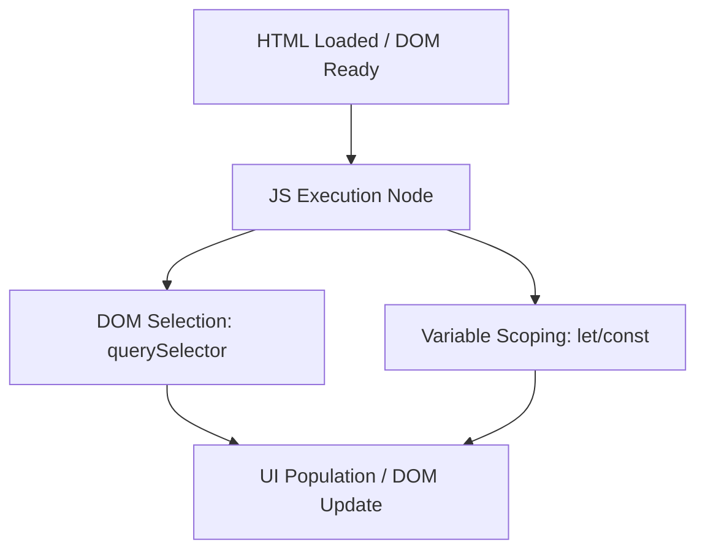
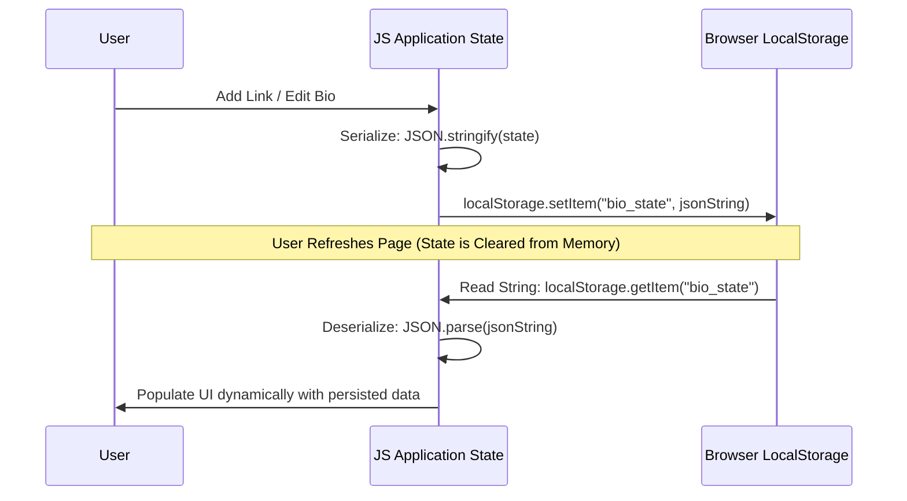
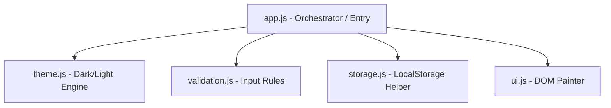

# Section A: Concept Application - Social Bio Link Builder

This document provides detailed conceptual answers for Section A of the JavaScript Essentials and Advanced assessment, explaining the core web technology mechanisms that power dynamic, high-performance creator profile link builders.

---

## 1. Dynamic UI Population: JS Execution, Scoping (let/const), and DOM Selection

Dynamic rendering requires three core pillars of client-side JavaScript to work in harmony:



### JS Execution
When a browser loads a web page, it parses the HTML and constructs the **Document Object Model (DOM)**. By placing our JavaScript file inside a `<script type="module">` block or loading it with the `defer` attribute, we ensure that JavaScript execution happens *after* the DOM is fully constructed. JavaScript execution runs on a single main thread, allowing us to synchronously or asynchronously fetch creator data (from a server or `localStorage`) and trigger functions that inject this data into our layout.

### Variable Scoping (`let` and `const`)
Modern ES6 variable scoping is block-scoped, protecting variables from leaking into the global scope:
* **`const`**: Declares block-scoped, read-only references. We use `const` for selecting UI elements (e.g., `const bioContainer = document.querySelector("#bio")`) and referencing data arrays that shouldn't be reassigned. This prevents accidental overwrites and ensures reference safety.
* **`let`**: Declares block-scoped reassignable variables. We use `let` for values that naturally change as the application runs, such as active pagination offsets or transient counts.

Because they are block-scoped, variables declared inside a render loop or event handler are isolated to that block, avoiding variable shadowing or memory leakage issues common with legacy `var` declarations.

### DOM Selection
DOM Selection acts as the bridge between JS data structures and actual visual nodes. Using modern selectors like `document.querySelector()` and `document.querySelectorAll()`, we can locate elements using standard CSS syntax. Once selected, we can dynamically manipulate their properties (e.g., `.textContent`, `.src`, `.style`) to paint our variables straight onto the user's screen.

---

## 2. Dynamic "Verified Creator" Badge: Logic, Truthiness, and DOM Manipulation

To automatically display a "Verified Creator" badge when a follower count crosses a threshold, we utilize reactive conditional checks and direct DOM tree manipulation.

```javascript
// Rule: Follower count >= 5000 is verified
const followerCount = 5200;
const badgeContainer = document.querySelector("#verification-badge");

if (followerCount >= 5000) {
  badgeContainer.innerHTML = `<span class="badge-verified">✓ Verified</span>`;
  badgeContainer.classList.add("visible");
} else {
  badgeContainer.innerHTML = "";
  badgeContainer.classList.remove("visible");
}
```

### Conditional Logic & Truthy/Falsy Values
JavaScript evaluates conditionals (`if/else` statements or ternary operators) by checking the truthiness of an expression.
* In JavaScript, values like `0`, `""` (empty string), `null`, `undefined`, `NaN`, and `false` are naturally **falsy**.
* Almost all other values—including non-empty strings, positive/negative numbers, arrays, and objects—are **truthy**.

When our data model updates, we check: `followerCount >= threshold`. This returns a boolean `true` or `false`. If the creator inputs an empty input (which evaluates to an empty string `""` or `0`), JavaScript handles it as a falsy value, ensuring the badge is safely hidden and prevents runtime errors.

### DOM Manipulation
Once the conditional branch is determined, DOM manipulation is performed to alter the visual state:
1. **Structural Alterations**: Injecting a custom HTML template for the badge inside a container (`badge.innerHTML = '...'`) or removing it entirely (`badge.innerHTML = ''`).
2. **Visual/Styling Updates**: Toggling class lists (`badge.classList.add('visible')` or `.classList.remove('visible')`). This is more performant than inline styling, as it triggers highly optimized hardware-accelerated CSS transitions.

---

## 3. Dynamic Link Lists: Arrays of Objects, Loops, and Template Literals

To maintain and render multiple social links cleanly, JavaScript combines structured collection models with templated markup generators.

```javascript
// 1. Array of Objects (Data Store)
const socialLinks = [
  { id: "1", title: "Instagram", url: "https://instagram.com/creator" },
  { id: "2", title: "YouTube", url: "https://youtube.com/creator" }
];

// 2. Loop & Template Literal (Render Engine)
const previewContainer = document.querySelector("#link-preview");
previewContainer.innerHTML = socialLinks.map(link => `
  <a href="${link.url}" target="_blank" class="preview-btn" id="btn-${link.id}">
    <span class="btn-title">${link.title}</span>
    <span class="btn-arrow">➔</span>
  </a>
`).join("");
```

### Arrays of Objects
An array of objects acts as a clean, in-memory database representation. Each object contains standard properties representing a single link entity: `{ id, title, url }`. This structure keeps our data isolated from the UI layout, allowing us to perform operations like filtering, sorting, or pushing new links without touching DOM rendering code directly.

### Loops & Array Iteration
Instead of using verbose legacy `for` loops, we use functional array methods like `.map()` or `.forEach()`. The `.map()` method is highly declarative: it runs an operation on each element of the array and returns a brand-new array of identical size containing the generated HTML strings.

### Template Literals (ES6 Backticks `` ` ``)
Template literals allow multiline strings and variable interpolation using `${expression}` syntax. This replaces tedious string concatenation (`"class='" + link.class + "'"`), making code highly readable, closely resembling HTML, and reducing syntax errors. Adding `.join("")` at the end converts our array of HTML template strings into a single contiguous HTML string that is safe to inject straight into an element's `.innerHTML` property in one single, high-performance DOM write operation.

---

## 4. LocalStorage & JSON Conversion: Persisting Creator State

HTTP is a stateless protocol, and standard browser tabs wipe memory buffers upon reload. To bypass this, we use `localStorage` and serialization to maintain a creator's state indefinitely.



### JSON Conversion (Serialization & Deserialization)
* **Serialization (`JSON.stringify`)**: `localStorage` is key-value based, but *only* accepts raw strings. Complex JS structures like our array of objects `[{title, url}]` cannot be stored directly. We use `JSON.stringify(links)` to transform our live object trees into plain, storage-safe JSON strings.
* **Deserialization (`JSON.parse`)**: When the page reloads, we read the JSON string back. We pass it through `JSON.parse(storedString)` to reconstruct it back into fully functional JavaScript arrays of objects.

### Synchronization Failures
If this state synchronization is missed or fails:
1. **Session Reset**: Every page reload, device rotation, or accidental back-swipe wipes out all custom links, forced themes, and avatar changes, leading to high user frustration.
2. **State Mismatch**: If `localStorage` is updated but the local JS memory array is not synced synchronously, our application will enter a split-state scenario where the UI displays stale data that differs from what is saved in the browser's persistent layer, causing runtime crashes or duplicate links.

---

## 5. Seamless Interactive Removals: Event Handling & Event Delegation

To make our profile editor feel premium and responsive, links must be deleted instantly. We implement this using a single, efficient event listener on a parent node.

```javascript
// Setup Event Listener on the Parent Container (Event Delegation)
const linkListContainer = document.querySelector("#editor-link-list");

linkListContainer.addEventListener("click", (event) => {
  // Check if the clicked element (or its parent) has the 'delete-btn' class
  const deleteBtn = event.target.closest(".btn-delete");
  
  if (deleteBtn) {
    const linkId = deleteBtn.getAttribute("data-id");
    
    // 1. Update core data array
    deleteLinkFromState(linkId);
    
    // 2. Remove the element from the DOM instantly with transition
    const linkRow = document.querySelector(`#editor-row-${linkId}`);
    linkRow.classList.add("slide-out"); // trigger CSS animation
    linkRow.addEventListener("animationend", () => {
      linkRow.remove(); // purge from DOM
      reRenderPreview(); // instantly update mock phone preview
    });
  }
});
```

### Event Propagation & Delegation
When an event occurs on a DOM node (e.g., clicking a "Remove" button deep within a list item), it doesn't just stop there. The event undergoes a phase called **Bubbling**—it travels up the DOM tree through all its parent nodes up to the `document` root.

Instead of attaching individual event listeners to every single delete button (which consumes substantial system memory and requires us to manually bind new listeners every time a link is added), we bind a **single listener** to the parent container (`#editor-link-list`).

When any child element within that list is clicked:
1. The click bubbles up to the `#editor-link-list` container.
2. The event handler catches it and inspects `event.target` (the exact element that was clicked).
3. Using `event.target.closest(".btn-delete")`, we check if the clicked node or any of its ancestors match our delete button.
4. If it does, we extract the metadata ID, update our state, animate the row away, and purge it from the DOM.

This ensures zero memory leaks, maximum performance, and automatic event handling for newly created elements.

---

## 6. Scaling Codebases: Modular JavaScript (ES6 Imports & Exports)

As a web application grows, packing all styles, business logic, validation, and rendering routines into a single monolithic script creates a "spaghetti code" structure that is incredibly difficult to debug, scale, or collaborate on. ES6 Modules (`import`/`export`) resolve this.



### How Modularity Improves Codebases
1. **Encapsulation & Scope Separation**: By default, code inside an ES6 module is scoped exclusively to that file. It does not bleed into the global window scope. Variables, functions, and helper classes are private unless explicitly prefixed with the `export` keyword.
2. **Reusability**: Shared utilities can be imported across multiple pages. For example, our URL checking regular expressions inside `validation.js` can be imported both on the profile link page and a future user settings page.
3. **Explicit Dependency Mapping**: At the top of each file, dependencies are clearly listed (e.g., `import { validateUrl } from './validation.js'`). Developers and build tools can easily trace data flows and detect unused imports.
4. **Optimized Compilation**: ES modules allow modern build tools (Vite, Webpack) to perform **Tree Shaking**—pruning unused exports during build time—keeping production code bundles as lightweight as possible.
